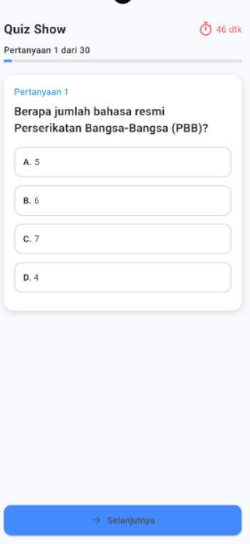
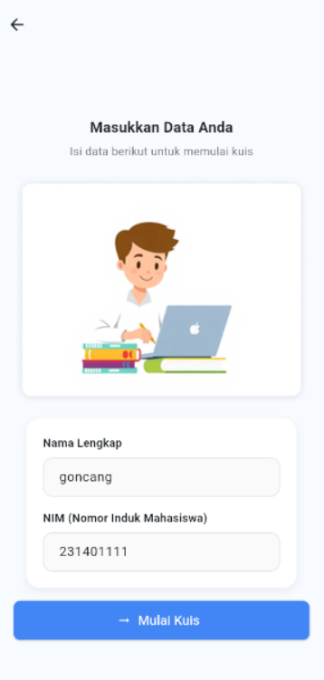

# 🧑‍💻 Identitas

**Nama:** Muhammad Goncang Samudera Nasution  
**NIM:** 231401111
**Lab:** PM 6

---

# 🧠 Nama Aplikasi

**QuizShow — Aplikasi Kuis Pilihan Ganda**

---

# 📱 Deskripsi Aplikasi

**QuizShow** adalah aplikasi kuis interaktif yang dirancang untuk menguji pengetahuan pengguna melalui pertanyaan pilihan ganda.  
Pengguna dapat menjawab pertanyaan satu per satu, melihat skor akhir, dan mengasah kemampuan berpikir cepat serta daya ingat mereka.

Aplikasi ini dibuat menggunakan **Flutter**, dengan tampilan yang sederhana dan responsif agar dapat digunakan di berbagai perangkat.

# 🖼️ Screenshot / 🎥 Video Aplikasi

**Tampilkan Halaman Utama:**

**Tampilan Pertanyaan Kuis:**

**Tampilan Isi Data User:**

**Tampilan Skor User:**

<!-- **Video Demo:**
[Klik untuk menonton video demo](https://youtu.be/contoh-link-video) -->

---

# 🧩 Link Mockup / Prototype

Lihat desain mockup aplikasi di sini:  
[Figma Prototype — QuizShow](https://www.figma.com/design/1h8Rm5IFsrmfptkY7XkJ4H/Untitled?node-id=0-1&t=oxMGWO2lw1A1O6J4-1)

---
